# 🧭 Align — 여행하게 백엔드 아키텍처 회고

> 게스트하우스 예약 · 실시간 커뮤니티 · 여행 동행 매칭을 하나로 묶은 크로스플랫폼 여행 플랫폼의 **백엔드 설계 회고**입니다.
> 시스템 구조 · 기술적 의사결정 · 트레이드오프 · 배운 점을 정리했습니다. 도메인별 심화는 [`docs/`](./docs), 인프라 설정은 [`infra/`](./infra)에 있으며, 핵심 로직은 **짧은 코드 스니펫**으로 인용했습니다.
>
> ⚠️ 이 저장소는 상용·팀 프로젝트의 **회고**입니다. 서비스 전체 소스는 담지 않고, 핵심 메커니즘만 **시크릿을 제거한 스니펫**으로 발췌했습니다.

### 📱 서비스 화면

숙소 탐색 · 예약 · 여행 동행 · 커뮤니티 · 메시지 — 여러 탭으로 구성된 실제 서비스 앱입니다. <sub>(Flutter · 홈페이지 [yeohaenghage.com](https://yeohaenghage.com))</sub>

<table>
  <tr>
    <td align="center">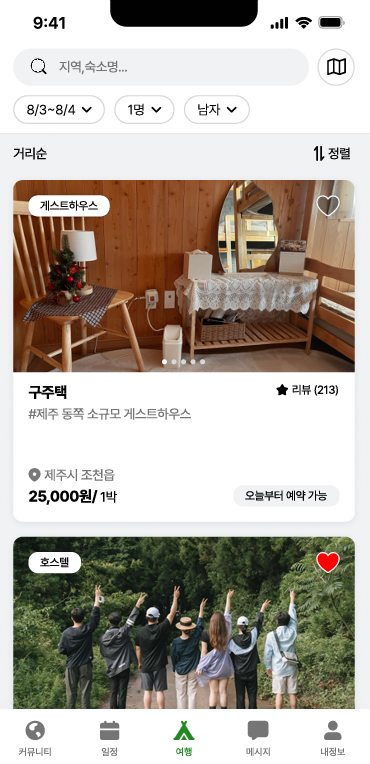<br><sub><b>홈 · 숙소 탐색</b></sub></td>
    <td align="center"><br><sub><b>게스트하우스 상세</b></sub></td>
    <td align="center"><br><sub><b>객실 선택 · 예약</b></sub></td>
    <td align="center">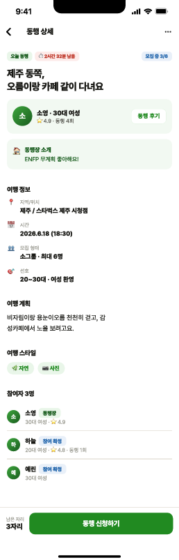<br><sub><b>여행 동행 상세</b></sub></td>
  </tr>
  <tr>
    <td align="center">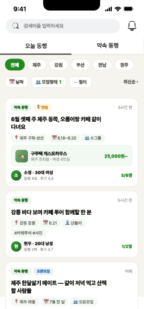<br><sub><b>동행 모집 목록</b></sub></td>
    <td align="center">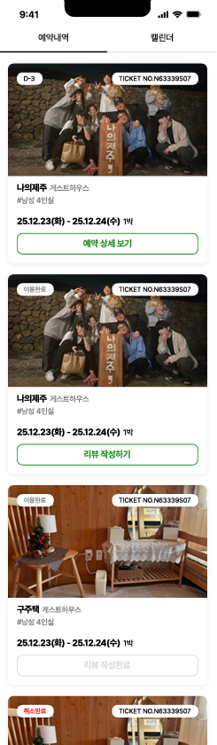<br><sub><b>예약 내역</b></sub></td>
    <td align="center">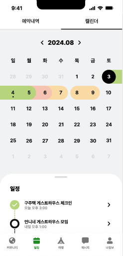<br><sub><b>예약 캘린더</b></sub></td>
    <td align="center">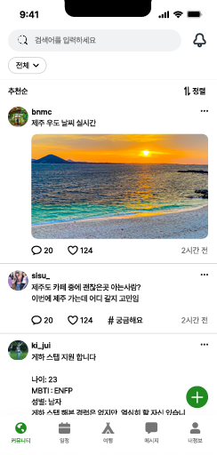<br><sub><b>커뮤니티 피드</b></sub></td>
  </tr>
  <tr>
    <td align="center">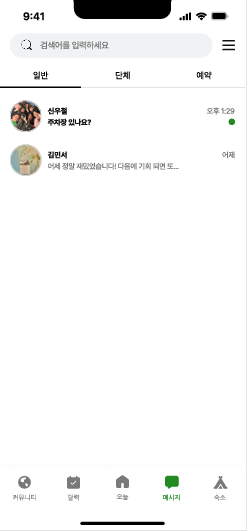<br><sub><b>메시지</b></sub></td>
    <td align="center">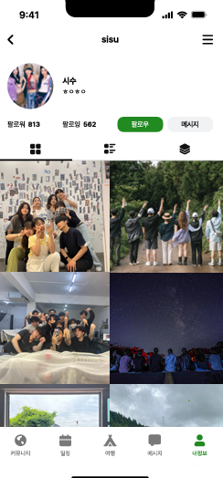<br><sub><b>유저 프로필</b></sub></td>
    <td align="center">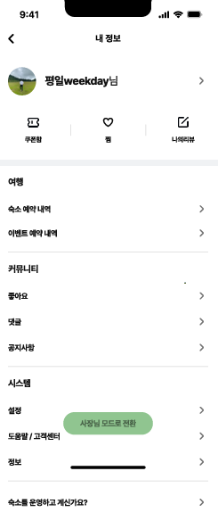<br><sub><b>내 정보</b></sub></td>
    <td></td>
  </tr>
</table>

> 🎨 화면 **디자인은 남궁찬**, **프론트엔드는 이진수([@kiwijuse](https://github.com/kiwijuse))** 가 담당했습니다. 이 저장소는 **백엔드·인프라 관점의 회고**입니다.

---

## 1. 프로젝트 개요

**여행하게 ([yeohaenghage.com](https://yeohaenghage.com))** 는 게스트하우스 예약·동행을 주 서비스로 하는 중개 플랫폼을 목적으로 시작한 프로젝트입니다.

| 역할 | 담당 |
|------|------|
| 기획 · 디자인 · 마케팅 | **남궁찬(팀 대표)** — 창업 아이템 기획, 앱 디자인, 마케팅 |
| 프론트엔드 | **이진수** ([@kiwijuse](https://github.com/kiwijuse)) — Flutter 앱 화면 구현 · 클라이언트측 연동 · 기능 개발 |
| **백엔드 · 인프라 (나)** | **서버 아키텍처 · 인프라 전체 · 백엔드–클라이언트 API 연동 개발** |

> 이 회고는 **백엔드·인프라**에 초점을 맞춥니다. 기획·디자인은 남궁찬, 프론트엔드는 이진수([@kiwijuse](https://github.com/kiwijuse))가 담당했습니다.

**사업자 등록 및 필수 법적 신고와 개발을 마치고 앱 출시 단계**까지 이르렀지만, 실서비스 직전 단계에서 마무리가 흐지부지되며 정식 런칭에는 이르지 못했습니다. 상용화까지 가지는 못했지만, **혼자서 결제·피드 랭킹 시스템·예약 정합성 등 분산 인프라를 처음부터 끝까지 설계**하며 백엔드 엔지니어로서 가장 많이 성장한 프로젝트였습니다.

> 이 저장소에 링크된 [기술 블로그 글](#7-관련-글--저장소)과 [벤치마크 저장소](#6-실측-성과)들은 **대부분 이 프로젝트를 진행하며 마주친 문제에서 나온 기록**입니다. 랭킹 시스템, 관측성 스택, 무상태 아키텍처, 동시성 방어 — 전부 여기서 출발했습니다.

---

## 2. 한눈에 보는 아키텍처

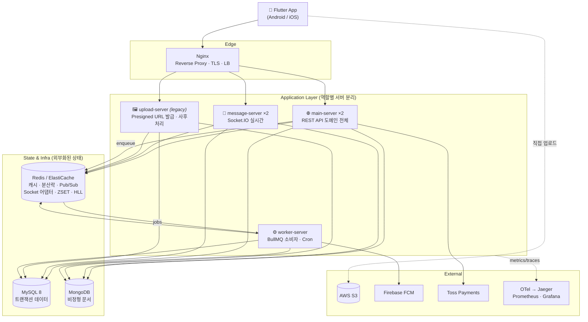

핵심 원칙은 **① 역할별 서버 분리**, **② 상태의 완전한 외부화(무상태)**, **③ 무거운 작업의 비동기 위임** 세 가지입니다.

---

## 🎬 데모

실제 서비스 앱 화면 녹화입니다. <sub>*민감정보(계좌번호·전화번호)는 모자이크 처리했습니다.*</sub>

<table>
<tr>
<td align="center">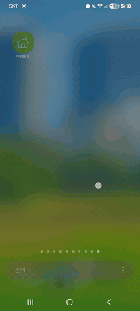<br><sub><b>앱 최초 진입 · 온보딩</b></sub></td>
<td align="center">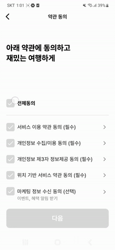<br><sub><b>회원가입 · 카카오 알림톡 본인인증</b></sub></td>
<td align="center">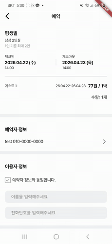<br><sub><b>게스트하우스 예약 · 결제</b></sub></td>
</tr>
</table>

---

## 📂 저장소 구조

```
align-retrospective/
├── README.md              ← 이 문서 (아키텍처 회고)
├── .env.example           ← 필요한 환경변수 목록 (값은 예시)
├── infra/                 ← 인프라 설정 (시크릿 제거)
│   ├── Dockerfile
│   ├── docker-compose.infra.yml   # Redis(Valkey) · MySQL · Nginx
│   ├── docker-compose.apps.yml    # 4개 앱 서버 (main×2 · message×2 · upload · worker)
│   ├── nginx.sample.conf          # 리버스 프록시 · LB · WebSocket 업그레이드
│   ├── prometheus.yml             # 메트릭 스크레이프 + relabel
│   └── log_watcher.sample.sh      # 에러 로그 → Discord 알림
├── docs/                  ← 도메인별 심화 (설계·트레이드오프 + 핵심 코드 스니펫)
│   ├── reservation-payment.md   # 예약 · 결제 · 정산
│   ├── ranking.md               # 커뮤니티 실시간 랭킹
│   ├── messaging.md             # 실시간 메시징 · 동행
│   ├── upload.md                # 이미지 업로드 (Presigned URL)
│   ├── auth.md                  # 인증 · Zero Trust
│   ├── geo-tiling.md            # 지도 타일 검색
│   ├── async-workers.md         # 비동기 워커 · 무상태
│   └── observability.md         # 관측성 스택
└── assets/
    ├── demos/             ← 앱 플로우 GIF (온보딩 · 회원가입 · 결제)
    └── screens/           ← 탭별 스크린샷 (홈·상세·객실·동행·예약·피드·프로필)
```

---

## 3. 서버 구성 — 왜 하나가 아니라 넷인가

처음엔 **단일 서버**로 시작했습니다. 하지만 API가 늘고 도메인이 넓어지면서 실시간 소켓 · 대용량 업로드 · 백그라운드 배치가 서로의 이벤트 루프를 갉아먹고, 코드 결합도가 높아지는 문제가 드러났습니다. 그래서 **역할과 도메인 기준으로 프로세스를 분리**하고, 나아가 **수평 확장이 가능하도록 각 서버를 무상태(stateless)로** 만드는 방향으로 진화시켰습니다.

- **상태의 외부화** — 서버 로컬에 두던 상태를 관리형 인프라로 독립: MySQL → **AWS RDS**, MongoDB → **Atlas**, Redis → **ElastiCache**. *(일부는 이후 비용 문제로 자체 호스팅으로 회귀)*
- **무상태일 수 없는 경우의 일관성** — 소켓 연결을 유지하는 message-server는 본질적으로 무상태가 될 수 없어, **Socket.IO Redis 어댑터**로 인스턴스 간 일관성을 확보. worker-server의 중복 실행은 **분산 락**으로 방어. *(관련 글: [무상태 아키텍처](https://yeohaenghage.kr/backend/server_stateless/))*

| 서버 | 책임 | 확장 · 일관성 |
|------|------|--------------|
| **main-server** ×2 | 로그인 · 예약 · 결제 · 커뮤니티 등 **대부분의 RESTful API** | 무상태 → **replica 수평 확장** |
| **message-server** ×2 | **소켓 기반 실시간 채팅** | Redis 어댑터로 인스턴스 간 브로드캐스트 |
| **worker-server** | 알림 · 스케줄러 · 동기화 · **낙관적 업데이트 후 큐잉** 등 백그라운드 처리 | 분산 락으로 중복 실행 방지 |
| **upload-server** *(legacy)* | S3 **Presigned URL 발급** + 업로드 후 **사후처리 API** | 파일 트래픽이 서버를 우회 (아래) |

### ⚙️ worker-server — "응답은 즉시, 처리는 뒤에서"
사용자 반응이 많은 작업(게시글 좋아요·조회수 등)의 사후 처리 — DB 반영, 실시간 랭킹 갱신, 알림 — 를 **라우터에서 직접 하지 않습니다.** 라우터는 **큐에 작업만 넣고 즉시 응답**하고(클라이언트는 낙관적 업데이트), 실제 처리는 worker가 백그라운드에서 소비합니다. 예약·메시지처럼 **알림이 필요한 경로**도 같은 패턴입니다.
- **중요도 기반 재시도** — 큐 작업마다 중요도를 평가해 재시도 정책을 달리했습니다. *좋아요 알림*은 트래픽은 많지만 중요도가 낮아 재시도를 최소화하고, *예약 발생·취소 알림*은 중요도가 높아 재시도(+백오프)를 보강했습니다.

### 🖼️ upload-server — "서버 경유"에서 "서버 우회"로
초기엔 **클라이언트 → 우리 서버 → S3 업로드 → DB 반영** 구조였는데, 무거운 파일 전송을 서버가 전담하는 게 병목이라 판단했습니다. 그래서 **서명된 Presigned URL만 발급하고 요청을 즉시 반환** → 클라이언트가 **S3에 직접 업로드** → 완료 후 연관 데이터로 **사후 API 호출** → 서버는 DB만 반영하는 구조로 바꿨습니다. 파일이 서버를 우회하니 REST로 가볍고 빠르게 처리됩니다.
- Presigned URL 발급 시 **용량 제한을 조건으로 걸어** 큰 파일 업로드를 원천 차단합니다(클라이언트가 압축 후 업로드). → [docs/upload.md](./docs/upload.md)
- 이 전환으로 별도 업로드 서버의 존재 이유가 줄어, 지금은 URL 발급·사후처리 엔드포인트만 남긴 얇은 **레거시 셸**이 됐습니다.

각 서버는 공통으로, `SIGTERM`에서 소켓/DB/Redis 연결을 순차 정리하는 **Graceful Shutdown**과 `--require ./logging/tracing.js`로 부팅 시 주입되는 **무침습 분산 추적**을 갖습니다.

---

## 4. 핵심 도메인과 기술적 도전

각 도메인의 **상세 설계·트레이드오프 + 핵심 코드 스니펫**은 [`docs/`](./docs)로 분리했습니다. 아래는 한 줄 요약입니다.

| 도메인 | 한 줄 요약 | 상세 |
|--------|-----------|------|
| 🏠 **예약·결제·정산** | 트랜잭션·`FOR UPDATE`·멱등 락으로 금전 정합성 방어, 주간 정산 배치 | [→](./docs/reservation-payment.md) |
| 📰 **커뮤니티 랭킹** | HLL 조회 집계 + ZSET Top-1000 + 마이크로배치 + 트렌딩 점수 | [→](./docs/ranking.md) |
| 💬 **실시간 메시징·동행** | Socket.IO + Redis 어댑터 클러스터링 + Pub/Sub + FCM 폴백 | [→](./docs/messaging.md) |
| 🖼️ **이미지 업로드** | Presigned URL로 서버 우회, S3 정책 레벨 용량·타입 강제 | [→](./docs/upload.md) |
| 🔐 **인증·보안** | Zero Trust 다층 방어, JWT·MFA·IDOR 방어 | [→](./docs/auth.md) |
| 🗺️ **지도 타일 검색** | 한반도를 2,580 타일로 분할해 Redis Set 공간 인덱싱 | [→](./docs/geo-tiling.md) |

> 대표적인 정량 검증: 동시성 방어 → **[concurrency-correctness-lab](https://github.com/pill27211/concurrency-correctness-lab)**, 비동기 쓰기 성능 → **[write-path-bench](https://github.com/pill27211/write-path-bench)** (처리량 **4.03×↑**, p99 **-64%**)

---

## 5. 상태 외부화와 관측성

- **무상태(Stateless)** — 모든 상태를 Redis/DB로 외부화해 서버를 replica로 수평 확장. Sentinel → **ElastiCache** 이전, 스케줄러 중복 실행은 **`SET NX EX` 분산 락**으로 방어. → [docs/async-workers.md](./docs/async-workers.md)
- **관측성** — `prom-client`+Prometheus/Grafana(메트릭), OTel **무침습 자동 계측**+Jaeger(추적), Discord 웹훅 알림(로그). → [docs/observability.md](./docs/observability.md)

> 관련 글: [무상태 아키텍처](https://yeohaenghage.kr/backend/server_stateless/) · [관측성 스택 구축기](https://yeohaenghage.kr/backend/monitoring/)

---

## 6. 실측 성과

이 프로젝트에서 내린 설계 결정들을 **재현 가능한 벤치마크로 분리·검증**했습니다.

| 저장소 | 검증 내용 | 결과 |
|--------|-----------|------|
| **[write-path-bench](https://github.com/pill27211/write-path-bench)** | 동기 vs BullMQ 비동기 쓰기 경로 | 처리량 **4.03×↑**, p99 **-64%**, p95 **-70.6%**, 에러 0% |
| **[concurrency-correctness-lab](https://github.com/pill27211/concurrency-correctness-lab)** | 레이스 컨디션 방어법 4종 + 분산 락 멱등성 | Naive/Atomic/Pessimistic/Optimistic 트레이드오프 + Fencing Token |

---

## 7. 관련 글 · 저장소

**기술 블로그 (Align Tech)**
- [무상태(Stateless) 아키텍처는 도대체 뭔가요?](https://yeohaenghage.kr/backend/server_stateless/)
- [실시간 랭킹 시스템 — ZSET과 마이크로 배치](https://yeohaenghage.kr/backend/post_ranking/)
- [분산 시스템 관측성(Observability) 스택 구축기](https://yeohaenghage.kr/backend/monitoring/)
- [Zero Trust — 모든 입력은 유죄라는 방어 설계](https://yeohaenghage.kr/backend/zero_trust_architecture_01/)

**벤치마크 · 실험 저장소**
- [write-path-bench](https://github.com/pill27211/write-path-bench)
- [concurrency-correctness-lab](https://github.com/pill27211/concurrency-correctness-lab)

---

## 8. 회고 — 잘한 점 · 아쉬운 점 · 배운 점

### 잘한 점
- **"요청-응답 서버"에서 "시스템 설계"로 관점이 넓어졌다.** 이전엔 클라이언트 요청을 받아 처리·응답하는 서버를 만드는 데 그쳤다면, 이 프로젝트를 기점으로 **확장성·정합성·관측성·비동기 처리까지 다방면으로 고도화된 서버**를 고민하기 시작했다. 그를 위해 캐시·큐·분산 락·분산 추적 등 **인프라 위의 강력한 도구들을 유기적으로 엮어 쓰는** 감각을 익혔다.
- **역할별 서버 분리**가 실시간·업로드·배치의 상호 간섭을 실제로 없앴다. 하나가 죽어도 나머지가 산다.
- 설계 결정을 "감"이 아니라 **벤치마크로 증명**하는 습관을 들였다 (4.03× 같은 숫자는 전부 실측).
- 결제·정산이라는 **틀리면 안 되는 도메인**을 트랜잭션·락·멱등성으로 방어하며 정합성 감각을 체득했다.

### 아쉬운 점
- **경험이 부족한 채 맨땅부터 설계했다.** DB 스키마·폴더 구조·스캐폴드를 감으로 시작하다 보니, 개발이 진행될수록 잘못 잡은 구조를 반복해서 갈아엎으며 적잖은 시간을 낭비했다.
- **확장성·유지보수를 충분히 고려하지 못한 초기 구조.** DB는 확장성을 염두에 두지 못했고, 도메인 서비스 코드도 라우터를 한 파일에 몰아넣어 **단일 파일이 1,000줄을 넘기기도** 했다 — 갈수록 유지보수·확장이 어려워졌다.
- **배포 파이프라인이 없었다.** CI/CD 없이 수동 배포에 가까웠고, 개발·운영 환경 분리도 느슨했다(운영에도 `nodemon`·소스 볼륨 마운트가 남음). 빌드 이미지 기반의 운영 전용 구성으로 분리했어야 했다.
- 상용화 직전에 프로젝트가 흐지부지 끝나 **실제 프로덕션 트래픽으로 검증하지 못했다** (부하 테스트는 합성 부하까지가 한계).

> 🌱 **이 아쉬움들이 다음 프로젝트로 이어졌습니다.** 이어진 프로젝트에서는 **CI/CD 파이프라인 구축**, **도메인별 폴더 구조 분리**, 배포 자동화 등으로 여기서 드러난 약점들을 정면으로 개선했습니다 — 그 이야기는 *다음 회고에서 이어집니다.* <sub>*(링크 추후 연결)*</sub>

### 배운 점
- **"상태를 어디에 둘 것인가"** 가 확장성의 8할이다. 무상태 설계 하나가 수평 확장, 무중단 배포, 장애 복원을 전부 열어준다.
- 비동기 위임은 공짜가 아니다 — **즉시 정합성 ↔ 최종 정합성**의 교환이며, 도메인마다 어느 쪽을 택할지 판단해야 한다.
- 관측성은 나중에 붙이는 게 아니라 **설계의 일부**다. 안 보이면 고칠 수 없다.

---

## 9. 기술 스택

**Runtime** Node.js · Express · Socket.IO
**Data** MySQL 8 · MongoDB · Redis (AWS ElastiCache)
**Async** BullMQ · node-cron
**Infra** Docker · Nginx · AWS (EC2/S3/SES/ElastiCache)
**Observability** OpenTelemetry · Jaeger · Prometheus · Grafana
**External** Firebase FCM · Toss Payments · Solapi
**Client** Flutter (Android / iOS)

---

## 🙏 감사의 말

- **QA · 테스트** — 앱 테스트를 자주 도와준 친구 [@Namhunk](https://github.com/Namhunk) — 여러 버그와 개선점을 함께 찾아줬다.

---

<sub>이 문서는 상용·팀 프로젝트의 아키텍처 회고이며, 포함된 코드는 시크릿을 제거한 스니펫입니다. · 문의: pill272119@gmail.com</sub>
